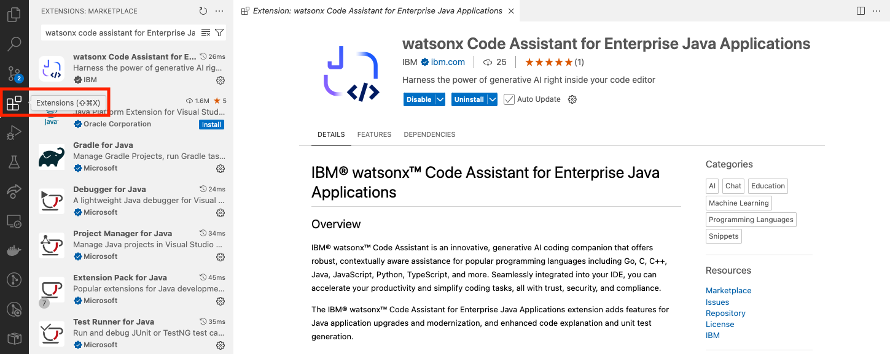

# Installation Guide for WCA extension on VSCode

This document provides information on installing software tools with IDE VSCode that are needed to run the **watsonx Code Assistant For Enterprise Java Application** (WCA - EJA) extension. Please note that this extension will interact with a back-end watsonx Code Assistant either installed on the Cloud or within your premises. The Hands-on Labs will be run with the cloud based back-end service.

Last updated: Nov 25th, 2024

## 1. Java Installation

### Install Java 21 using this link:
- [Download Java for MacOS - Arm64](https://download.oracle.com/java/21/latest/jdk-21_macos-aarch64_bin.tar.gz)
- [Download Java for MacOS - x86](https://download.oracle.com/java/21/latest/jdk-21_macos-x64_bin.tar.gz)
- [Download Java for Windows](https://download.oracle.com/java/21/latest/jdk-21_windows-x64_bin.zip)
All the above are compressed files, you can extract them to any folder on your local machine.

Check if Java is installed properly:
```bash
java --version
```

After installing java, add java to `PATH` variable and set `JAVA_HOME` envitonment variable by follwoing the instructions below:

### For Mac:
- Open `.zshrc` or `.bash_profile`
    ```bash
    nano ~/.zshrc
    ```
- Add the following lines:
    ```bash
    export JAVA_HOME=/Library/Java/JavaVirtualMachines/<java version>/Contents/Home
    ```
    ```bash
    export PATH=$JAVA_HOME/bin:$PATH
    ```
- Save the file and exit (press CTRL + X, then Y, and hit Enter)
- Reload the shell configuration so the changes take effect.
    ```bash
    source ~/.zshrc
    ```
- Check your `JAVA_HOME` environment variable with the following command:
    ```bash
    echo $JAVA_HOME
    ```

### For Windows:
- Open Environment variables using the Windows search bar (search for "edit environment variables" in the search bar).


- Set the `JAVA_HOME` variable using Environment variables (click on "New" if you do not have a `JAVA_HOME` set, or click on "Edit" to change the existing `JAVA_HOME`, and point it to the Java you installed in the earlier steps):


  ```bash
  JAVA_HOME=C:\Program Files\Java\jdk-21
  ```

- Add Java to your `PATH` using environment variables:


  ```bash
  %JAVA_HOME%\bin
  ```

## 2. Install Maven

### For Mac:
- Install Maven using Homebrew:
  ```bash
  brew install maven
  ```
- Check that maven is installed properly:
  ```bash
  mvn --version
  ```

### For Windows:
- Visit the official Maven website: [Maven Download Page](https://maven.apache.org/download.cgi)
- Under "Files", click on the binary zip archive link (e.g., apache-maven-x.x.x-bin.zip).
- Extract the zip file to a location of your choice, e.g., C:\Apache\maven.
- Set the `MAVEN_HOME` variable using Environment variables:
  ```bash
  MAVEN_HOME=C:\Apache\maven\apache-maven-3.9.9
  ```
- Add Maven to your `PATH` using Environment variables:
  ```bash
  <path-to-folder>\maven\apache-maven-3.9.9-bin\apache-maven-3.9.9\bin
  ```


## 3. Install VSCode

Visit the [VSCode Official Website](https://code.visualstudio.com/download) for installation.

## 4. Download the WCA - EJA Extension

Download the latest '**watsonx Code Assistant for Enterprise Java Applications**' VSCode Extension from the marketplace.


> **Note:** You will notice that 2 VSCode extensions are automatically downloaded. This is because the '**watsonx Code Assistant for Enterprise Java Applications**' extension depends on some services provided by the core '**watsonx Code Assistant**' extension.

## 5. WCA - EJA API Key

The VSCode extension requires a connection to a **watsonx Code Assistant** SaaS service. The authentication to the backend service can be completed using an API key.

As of now, the API Key will be provided by IBMers. Please reach out to IBMers for help on this.

## 6. Setting up WCA - EJA Extension

Login with the WCA - EJA API Key at the bottom left corner of VSCode. After successfully signing in, the number indicator should be gone.


> **Note:** If you encounter an issue during authorization that says **"administrator needs to associate you with a deployment space"**, please reach out to IBMers to set up the deployment space again for your API Key.


## 7. Installing Liberty Tools and Java Extension

Install the Liberty Tools and Extension Pack for Java extensions from the VSCode marketplace as shown below.


## 8. Start Using watsonx Code Assistant

You can check if your API Key is set up correctly by navigating to the **watsonx Code Assistant** tab and opening the chat window to chat with the model.

