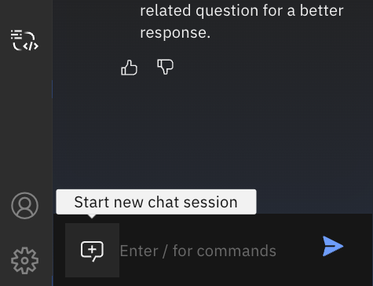
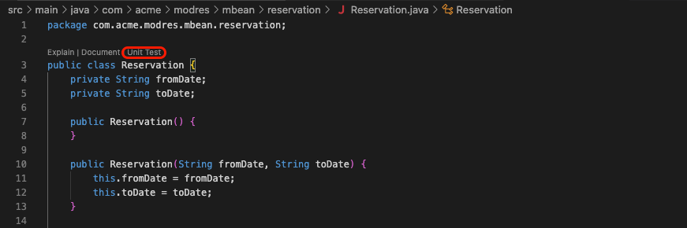
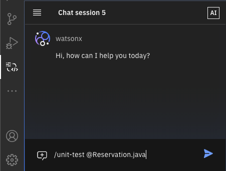
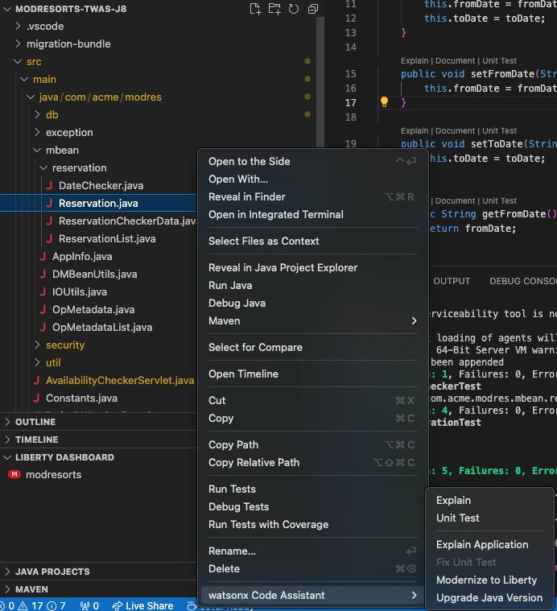
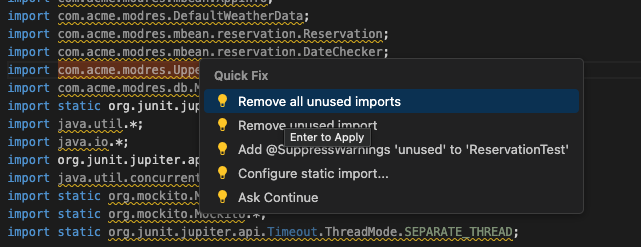

# **Hands-on Lab #4: Generating Unit Tests with watsonx Code Assistant**

## **Objective**

**watsonx Code Assistant** allows you to generate unit tests for various programming languages from the chat, the CodeLens in the editor, or the context menu. In this lab, you will learn how to generate unit tests for a specific Java class from our lab application.

## **Step 0: Reset WCA chat session**

Create a new chat session in the WCA extension chat window.



## **Step 1: Generate unit test for a given Java class**

Let's start by selecting a Java class to generate unit tests against, e.g. `src/main/java/com/acme/modres/mbean/reservation/Reservation.java`.

There are 3 options to generate unit tests in **watsonx Code Assistant**:

### **Option 1: Generate Unit Tests using CodeLens**

1.  Open your code, e.g. the `src/main/java/com/acme/modres/mbean/reservation/Reservation.java` class, in the IDE editor.
2.  Click the **Unit Test** option in the **CodeLens** that precedes a code block.
3.  The watsonx Code Assistant chat window will open and display the `/unit-test` command.
4.  The unit test will be generated and displayed in the chat window.



### **Option 2: Generate Unit Tests using Chat Command**

1.  Open the chat window in your IDE.
2.  Type the `/unit-test` command followed by the `@` symbol to see a list of classes, files, functions, and methods from your workspace.
3.  Select the class, file, function, or method reference that you want, e.g. `src/main/java/com/acme/modres/mbean/reservation/Reservation.java`.
4.  *Optionnal*: Add instructions to your prompt if you want specific details.
5.  Press **Enter** to generate the unit test.



**Example Prompts:**

*   File: `/unit-test @Reservation.java`
*   Class: `/unit-test @Reservation`
*   Method: `/unit-test @setFromDate()`

### **Option 3: Generate Unit Tests from Context Menu**

1.  In the Explorer view, expand your application to the code you want to generate a unit test for.
2.  Right-click the code and select **watsonx Code Assistant** > **Unit Test**.
3.  The watsonx Code Assistant chat will display the `/unit-test` command for the selected code.
4.  The unit test will be generated and displayed in the chat window.



## **Step 2: run generated Unit Tests**

1. If needed, create a new directory for tests e.g.:
    ```sh
    mkdir -p src/test/java/com/acme/modres/mbean/reservation
    ```
2. Copy the generated test class into a new file in the test directory e.g. `src/test/java/com/acme/modres/mbean/reservation/ReservationTest.java`, and rename the generated class name from `WCA_Reservation_Test` to `ReservationTest` before saving.
   - **Troubleshooting**:
      - If needed, remove unnecessary imports like `import com.acme.modres.mbean.DMBeanUtilsTest;`, you can use the VS Code **quick fix** feature to remove unused imports
        
       - If you have errors like some tests trying to access the `private toDate` attribute from the reservation class, fix them by replacing `res.toDate` with the matching getter `res.getToDate()`.
       - If you have unresolved test dependencies errors, check that:
          1. You have put the `ReservationTest` class under the `test` directory.
          2. You have the correct dependencies defined in your `pom.xml`:
                ```xml
                ...
                    <dependency>
                    <groupId>org.junit.jupiter</groupId>
                    <artifactId>junit-jupiter-api</artifactId>
                    <version>5.10.0</version>
                    <scope>test</scope>
                    </dependency>
                    <dependency>
                    <groupId>org.mockito</groupId>
                    <artifactId>mockito-core</artifactId>
                    <version>5.12.0</version>
                    <scope>test</scope>
                    </dependency>
                    <dependency>
                    <groupId>org.mockito</groupId>
                    <artifactId>mockito-junit-jupiter</artifactId>
                    <version>5.12.0</version>
                    <scope>test</scope>
                    </dependency>
                    <dependency>
                    <groupId>org.springframework</groupId>
                    <artifactId>spring-web</artifactId>
                    <version>6.1.6</version>
                    <scope>test</scope>
                    </dependency>
                    <dependency>
                    <groupId>org.springframework</groupId>
                    <artifactId>spring-test</artifactId>
                    <version>5.3.36</version>
                    <scope>test</scope>
                    </dependency>
                ...
                ```
3. Run the generated unit tests by executing the following command in a terminal from the application root directory `modresorts-twas-j8`:

    ```
    mvn test
    ```

You should see the result of the unit tests, e.g.:

```sh
wca4ej-workshop/modresorts-twas-j8
❯ mvn test
[INFO] Scanning for projects...
[INFO] 
[INFO] ---------------------< com.acme.modres:modresorts >---------------------
[INFO] Building ModResorts 2.0.0
[INFO]   from pom.xml
[INFO] --------------------------------[ war ]---------------------------------

... OMMITED...

[INFO] 
[INFO] -------------------------------------------------------
[INFO]  T E S T S
[INFO] -------------------------------------------------------

... OMMITED...

[INFO] Running com.acme.modres.mbean.reservation.ReservationTest
[INFO] Tests run: 4, Failures: 0, Errors: 0, Skipped: 0, Time elapsed: 0.005 s -- in com.acme.modres.mbean.reservation.ReservationTest
[INFO] 
[INFO] Results:
[INFO] 
[INFO] Tests run: 5, Failures: 0, Errors: 0, Skipped: 0
[INFO] 
[INFO] ------------------------------------------------------------------------
[INFO] BUILD SUCCESS
[INFO] ------------------------------------------------------------------------
[INFO] Total time:  1.859 s
[INFO] Finished at: 2024-11-26T14:05:36+01:00
```

## **Tips and Variations**

*   For Java, make sure your `pom.xml` file includes the required dependencies (JUnit, Mockito, and Spring).
*   Use the `@` symbol to select a class, file, function, or method reference.
*   Add optional instructions to customize the generated unit test.
*   Use the CodeLens or context menu to generate unit tests for a specific code block or selection.

## **Known Issues**

- `To support the unit test, update the application to Java 9.`: You can safely ignore this warning message from the assistant when generating unit tests.

## **Conclusion**

By completing this lab, you have learned how to generate unit tests using watsonx Code Assistant. You can now apply this knowledge to your own projects and improve your testing workflow.
